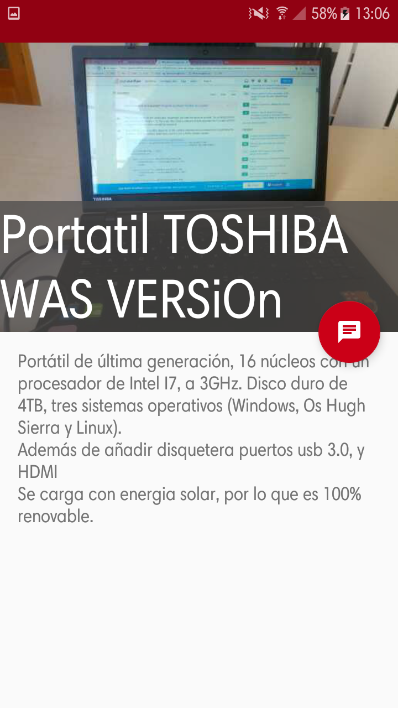

# App-Compra-Venta
App para la Asignatura Laboratorio de discpositivos moviles de la URJC
 
 [APK DOWNLOAD](https://drive.google.com/open?id=1VoCwylB85xRevmN5coeOU77_4tMve3rt)
   
   [Memoria pdf](https://drive.google.com/open?id=1mrEkZSJ0KdbGfk1xEDv_-G2tEd8tmS9_)

 
Nuestra aplicacion se basa en una aplicacion de compra y venta sin pago a traves de la app, cuya funcion principal es poner en contacto al comprador y vendedor.
Consta por tanto de las siguientes funciones:

    Control de Usuarios
    Adicion de anuncios
    Base de datos local
    Vista de productos de interes del usuario
    Vista perfil de usuario
    Contacto a traves de email
    
Esta apliacion usa los siguientes permisos del sistema

    Acceso a camara
    Lectura de memoria
    Escritura de memoria 
    Internet

## Pantallas  
### Activities  
###### MainActivity  
Splash Screen. 
 Consta de una imagen presentacion de los desadorrallores
###### WelcomeActivity  
 Actividad que nos presenta la aplicacion.  
 Tiene la funcionalidad de redireccionar a la pagina de loginActivty o MenuActivity, segun si estamos logeados o no.

###### LoginActivty  
Ventana con los dialogos para iniciar la sesion    
Consta de 2 AlertDialog que aparecen al pulsar los respectivos botones de inicio sesion y registro  
En el registro de usuario es necesario rellenar los 3 campos (Nombre Usuario, Email y Contraseña) siendo posible posteriormente editar 2 de esos campos(Contraseña y Email)
En este registro se valida que el email o nombre de usuario no estan anteriormente registrados en la base de datos .  
En el inicio de sesion se necesitaran tanto el nombre de usuario como contraseña. En caso de error a la hora del inicio de sesion, se le notifica al usuario del problema
 
 
 
##### MenuActivity
Actividad principal de la app, compuesta por 3 fragments(Compra ,Venta e Interes) a traves de un Fragment Adapter en un TabLayaut,
con una toolbar con el nombre de la aplicacion, y tres botones: 

    Añadir articulo
    Perfil usuario
    Cerrar Sesion
   
Esta Actividad nos permitira visitar las tres ventanas, la primera la de compra nos permitira ver los articulos que añadan los demas usuarios, con la posibilidad de mostrar interes a traves del boton habilitado para ello
Cuando se pulse es boton, se enviara al correo del usuario las especificaciones del anuncio, ademas de añadirse a la lista de articulos con interes
La segunda ventana se dispondra para la venta de articulos
La tercera para los articulos sobre los que se muestra interes
        
##### ProfileActivity
Ventana que nos muestra el perfil del usuario con el que estamos logeados
##### ArticuloActivity
Actividad que nos permite visualizar los detalles del anuncio seleccionado
##### AddArticuloActivity
Actividad que nos permite añadir un articulo para venderlo.
Con posibilidad de añadir imagen a traves de la Galeria de nuestro telefono o a traves de la camara

##### ChangePasswordActivity  
Actividad que nos permite cambiar la contraseña del usuario
##### ChangeEmailActivity
Actividad que nos permite cambiar el email del usuario
### Fragments  

CompraFragment  
RecyclerView  que muestra los articulos en venta del resto de usuarios 
 
VentaFragment  
RecyclerView  que muestra los articulos en venta del usuarios  

InteresFragment  
RecyclerView  que muestra los articulos en interes del usuarios  
### Utils
Database  
Base de datos SQLite, con tres tablas( Articulos,Usuarios y Articulos de interes)   
PrefManager    
Clase que nos permite saber a traves de   SharedPreferences si es la primera vez que se ejecuta la app
SessionManager  
Clase necesaria para los datos de sesion, saber si un usuario esta logeado, si ha cerrado sesion o cual es su id, nombre o email  
### Class
Articulo  
User

## Imagenes
 

